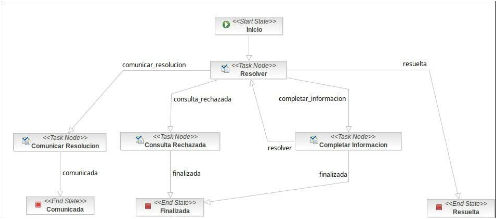

 
 
 
 

<h1>Swiss Medical Group S.A.</h1>

<h2>Proyecto Migración BPM</h2>

<h3>Documento Funcional</h3>

 
 
 
 
 
 
 
 
 
 
 
 
 
 
 
 
 
 
 
 

<table>
<tbody>
<tr>
<td>Número de Versión:</td>
<td>1.0.0-SNAPSHOT</td>
</tr>
<tr>
<td>Autores:</td>
<td>RedHat</td>
</tr>
<tr>
<td>Fecha del Documento:</td>
<td>22/12/2020</td>
</tr>
</tbody>

</table>

 
 
 
 
 
 
 
 

## Funcionalidades

- [Atención CIC (Centro Atención Integral Clientes)](./README.md#QXRlbmNpw7NuIENJQyAoQ2VudHJvIEF0ZW5jacOzbiBJbnRlZ3JhbCBDbGllbnRlcyk=)

<h2 id="QXRlbmNpw7NuIENJQyAoQ2VudHJvIEF0ZW5jacOzbiBJbnRlZ3JhbCBDbGllbnRlcyk=" style="color:steelblue">Atención CIC (Centro Atención Integral Clientes)</h2>

  
  El proceso permite la gestión por el CIC (Reclamos, quejas, 	etc.) 
  desde SGI hasta llegar a los estados de “comunicada”, “finalizada” y “resuelta”.
  
  

  Observaciones / Comentarios
  - Este proceso en particular tiene un SLA a nivel de cada tarea y uno a nivel proceso. El mismo es configurable por Base de Datos en función al motivo y a la tarea.
  - En la documentación provista por SMG, se encuentra referencia a las tareas de “Adjuntar documentación” en el archivo “T-17459 R-Atención CIC - Tarea Adjuntar Documentacion.docx” y tarea Envío de Encuesta en el archivo  “T-17467 R- Atención CIC - Envió de Encuesta.docx”.
  - Tener en cuenta Bandeja. Ver documento “T-17465 R -Atención CIC - Detalle tramite en bandeja.docx”.

### Escenarios:

- [1) Resolver -> Inicio exitoso](./README.md#MSkgUmVzb2x2ZXIgLT4gSW5pY2lvIGV4aXRvc28=)
- [2) Resolver -> Inicio fallido con confirmacion de reintento](./README.md#MikgUmVzb2x2ZXIgLT4gSW5pY2lvIGZhbGxpZG8gY29uIGNvbmZpcm1hY2lvbiBkZSByZWludGVudG8=)
- [3) Comunicar Resolución](./README.md#MykgQ29tdW5pY2FyIFJlc29sdWNpw7Nu)
- [4) Consulta Rechazada](./README.md#NCkgQ29uc3VsdGEgUmVjaGF6YWRh)
- [5) Completar Informacion](./README.md#NSkgQ29tcGxldGFyIEluZm9ybWFjaW9u)

<h3 id="MSkgUmVzb2x2ZXIgLT4gSW5pY2lvIGV4aXRvc28=" style="color:steelblue;border-bottom:1px solid #eaecef;">1) Resolver -> Inicio exitoso</h3>

  

  

  Se toma y abre el trámite. Se visualizan los campos cargados, permitiendo sólo la edición de observaciones. El sistema permite cargar hasta 5 archivos (optativo). Depende del caso, se puede marcar si se ha realizado el contacto telefónico con el socio. 

  En función a esa marca, más adelante se enviará el email con el link a la encuesta. (interacción con sistema BDT revisar detalles técnicos) Se selecciona la próxima acción para transicionar la tarea. (Resuelta / Consulta / Rechazada / Completar Información / Comunicar Resolución).

  

  

  ---------------------------------------

**Dado** que soy 'adminUser' y pertenezco al grupo 'SGI'

  

**Entonces** verificar el flujo de ejecución sea el siguiente: Inicio -> "Inserción de datos en el CRM, Resolver" -> Fin

<h3 id="MikgUmVzb2x2ZXIgLT4gSW5pY2lvIGZhbGxpZG8gY29uIGNvbmZpcm1hY2lvbiBkZSByZWludGVudG8=" style="color:steelblue;border-bottom:1px solid #eaecef;">2) Resolver -> Inicio fallido con confirmacion de reintento</h3>

**Dado** que soy 'adminUser' y pertenezco al grupo 'SGI'

  

**Y** falla la Inserción de datos en el CRM

  

**Entonces** verificar el flujo de ejecución sea el siguiente: Inicio -> "Inserción de datos en el CRM" -> Fin

<h3 id="MykgQ29tdW5pY2FyIFJlc29sdWNpw7Nu" style="color:steelblue;border-bottom:1px solid #eaecef;">3) Comunicar Resolución</h3>

  

  

  Se toma y abre el trámite. Se completan los campos de observación y se transiciona con la opción de Comunicar.

  Se envía un email con la encuesta cuando se encuentra la marca de comunicado al cliente (en el e-mail se indica sucursal, ejecutivo que atendió y trámite realizado).

  

  

**Dado** que soy 'adminUser' y pertenezco al grupo 'SGI'

  

**Y** tomo la tarea en estado 'Resolver' y la transiciono al estado 'comunicarResolucion'

  

**Entonces** verificar el flujo de ejecución sea el siguiente: Inicio -> "Inserción de datos en el CRM, Resolver, actualizar de datos en el CRM, Comunicar Resolución, actualizar de datos en el CRM" -> Fin

  

<h3 id="NCkgQ29uc3VsdGEgUmVjaGF6YWRh" style="color:steelblue;border-bottom:1px solid #eaecef;">4) Consulta Rechazada</h3>

  

  

  Se toma y abre el trámite. Se completan los motivos del rechazo y se finaliza el trámite.

  

  

**Dado** que soy 'adminUser' y pertenezco al grupo 'SGI'

  

**Y** tomo la tarea en estado 'Resolver' y la transiciono al estado 'consultarRechazada'

  

**Entonces** verificar el flujo de ejecución sea el siguiente: Inicio -> "Inserción de datos en el CRM, Resolver, actualizar de datos en el CRM, Consulta Rechazada, actualizar de datos en el CRM" -> Fin

  

<h3 id="NSkgQ29tcGxldGFyIEluZm9ybWFjaW9u" style="color:steelblue;border-bottom:1px solid #eaecef;">5) Completar Informacion</h3>

  

  

  Se toma y abre el trámite. Se completan las observaciones y se puede devolver o finalizar el trámite. Si se selecciona Devolver, vuelve a la tarea de Resolver. Siempre se vuelve a la sucursal de origen del trámite, a excepción de la sucursal denominada call center, donde el trámite debe dirigirse a “Back Office Call Center” (ABM_BACK_OFFICE_CALL_CENTER).  Si se selecciona Finalizar, avanza a finalizada.

  

  

**Dado** que soy 'adminUser' y pertenezco al grupo 'SGI'

  

**Y** tomo la tarea en estado 'Resolver' y la transiciono al estado 'completarInformacion'

  

**Entonces** verificar el flujo de ejecución sea el siguiente: Inicio -> "Inserción de datos en el CRM, Resolver, actualizar de datos en el CRM, Completar Información, actualizar de datos en el CRM" -> Fin

